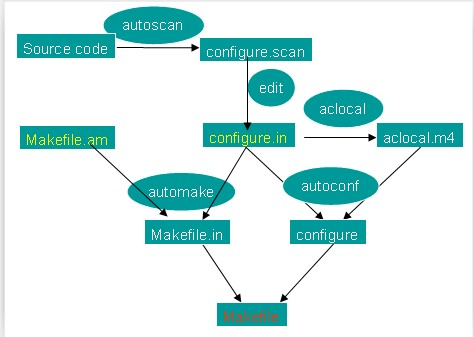

##automake 自动生成 makefile

对于一般的linux下面的工程，我们会简单的手写一些Makefile，但是如果工程比较大，文件比较多，就需要使用自动的工具来帮忙生成Makefile，我们可以使用 autoscan; aclocal; autoconf; autoheader; automake --add-missing; ./configure; make; 等操作来生成

### 举例：
step 1. 新建一个目录，在里面建立一个文件testmake.c

	#include <stdio.h>
	#include <stdlib.h>
	                
	int main()   
	{               
	    printf("TEST FROM make !!\n");
	    return 0;                                                                                                            
	} 

step 2. 生成configure，见configure.scan 命名为 configure.ac

	$ autoscan
	$ ls
	$ autoscan.log  configure.scan  testmake.c
 	$ cp configure.scan configure.ac

step 3. 打开configure.ac进行修改

	#                                               -*- Autoconf -*-                                                                                                                                        
	# Process this file with autoconf to produce a configure script.
	                           
	AC_PREREQ([2.69])          
	#AC_INIT([FULL-PACKAGE-NAME], [VERSION], [BUG-REPORT-ADDRESS])
	AC_INIT(testmake, 1.0, xxx@163.com)
	AM_INIT_AUTOMAKE(testmake, 1.0)  #这句话很重要，否则下面aclocal出错
	AC_CONFIG_SRCDIR([testmake.c])
	AC_CONFIG_HEADERS([config.h])
	                           
	# Checks for programs.     
	AC_PROG_CC                 
	                           
	# Checks for libraries.    
	                           
	# Checks for header files. 
	AC_CHECK_HEADERS([stdlib.h])
	                           
	# Checks for typedefs, structures, and compiler characteristics.
	                           
	# Checks for library functions.
	                           
	AC_CONFIG_FILES([Makefile])
	AC_OUTPUT   

step 4. 执行命令aclocal和autoconf，分别会产生aclocal.m4及configure两个文件：

	$ aclocal
	e$ ls
	aclocal.m4  autom4te.cache  autoscan.log  configure.ac  configure.scan  testmake.c
	$ autoconf
	$ ls
	aclocal.m4  autom4te.cache  autoscan.log  configure  configure.ac  configure.scan  testmake.c
	$ 

step 5. 在执行automake --add-missing之前执行autoheader, 生成config.h.in

	$ ls
	aclocal.m4  autom4te.cache  autoscan.log  config.h.in  configure  configure.ac  configure.scan testmake.c

step 6. 新建Makefile.am

	AUTOMAKE_OPTIONS=foreign
	  
	bin_PROGRAMS=testmake
	     
	testmake_SOURCES=testmake.c  

automake会根据你写的Makefile.am来自动生成Makefile.in。Makefile.am中定义的宏和目标,会指导automake生成指定的代码。例如，宏bin_PROGRAMS将导致编译和连接的目标被生成。

step 7. automake 

	$ automake --add-missing
	configure.ac:7: warning: AM_INIT_AUTOMAKE: two- and three-arguments forms are deprecated.  For more info, see:
	configure.ac:7: http://www.gnu.org/software/automake/manual/automake.html#Modernize-AM_005fINIT_005fAUTOMAKE-invocation
	configure.ac:12: installing './compile'
	configure.ac:7: installing './install-sh'
	configure.ac:7: installing './missing'
	Makefile.am: installing './depcomp'

automake会根据Makefile.am文件产生一些文件，包含最重要的Makefile.in。

step 8. 执行configure生成Makefile

	$ ./configure 
	checking for a BSD-compatible install... /usr/bin/install -c
	checking whether build environment is sane... yes
	checking for a thread-safe mkdir -p... /bin/mkdir -p
	checking for gawk... no
	checking for mawk... mawk
	checking whether make sets $(MAKE)... yes
	checking whether make supports nested variables... yes
	checking for gcc... gcc
	checking whether the C compiler works... yes
	checking for C compiler default output file name... a.out
	checking for suffix of executables... 
	checking whether we are cross compiling... no
	checking for suffix of object files... o
	checking whether we are using the GNU C compiler... yes
	checking whether gcc accepts -g... yes
	checking for gcc option to accept ISO C89... none needed
	checking whether gcc understands -c and -o together... yes
	checking for style of include used by make... GNU
	checking dependency style of gcc... gcc3
	checking how to run the C preprocessor... gcc -E
	checking for grep that handles long lines and -e... /bin/grep
	checking for egrep... /bin/grep -E
	checking for ANSI C header files... yes
	checking for sys/types.h... yes
	checking for sys/stat.h... yes
	checking for stdlib.h... yes
	checking for string.h... yes
	checking for memory.h... yes
	checking for strings.h... yes
	checking for inttypes.h... yes
	checking for stdint.h... yes
	checking for unistd.h... yes
	checking for stdlib.h... (cached) yes
	checking that generated files are newer than configure... done
	configure: creating ./config.status
	config.status: creating Makefile
	config.status: creating config.h
	config.status: executing depfiles commands
	$ls
	aclocal.m4      autoscan.log  config.h     config.log     configure     configure.scan  install-sh  Makefile.am  missing   testmake.c
	autom4te.cache  compile       config.h.in  config.status  configure.ac  depcomp         Makefile    Makefile.in  stamp-h1

configure结束，Makefile就出来了

step 9. make和执行

	$ make
	make  all-am
	make[1]: Entering directory `/home/jklou/Todo/jkl/testmake'
	gcc -DHAVE_CONFIG_H -I.     -g -O2 -MT testmake.o -MD -MP -MF .deps/testmake.Tpo -c -o testmake.o testmake.c
	mv -f .deps/testmake.Tpo .deps/testmake.Po
	gcc  -g -O2   -o testmake testmake.o  
	make[1]: Leaving directory `/home/jklou/Todo/jkl/testmake'
	$ ls
	aclocal.m4      autoscan.log  config.h     config.log     configure     configure.scan  install-sh  Makefile.am  missing   testmake    testmake.o
	autom4te.cache  compile       config.h.in  config.status  configure.ac  depcomp         Makefile    Makefile.in  stamp-h1  testmake.c
	$ ./testmake 
	TEST FROM make !!

通过上面的步骤，Makefile出来了，并且编译成功了。

### 命令解释

#### 1、 autoscan

　　autoscan是用来扫描源代码目录生成configure.scan文件的。autoscan可以用目录名做为参数，但如果你不使用参数的话，那么autoscan将认为使用的是当前目录。autoscan将扫描你所指定目录中的源文件，并创建configure.scan文件。

#### 2、 configure.scan

　　configure.scan包含了系统配置的基本选项，里面都是一些宏定义。我们需要将它改名为configure.ac

#### 3、 aclocal

　　aclocal是一个perl 脚本程序。aclocal根据configure.ac文件的内容，自动生成aclocal.m4文件。aclocal的定义是：“aclocal - create aclocal.m4 by scanning configure.ac”。

#### 4、 autoconf

　　使用autoconf，根据configure.in和aclocal.m4来产生configure文件。configure是一个脚本，它能设置源程序来适应各种不同的操作系统平台，并且根据不同的系统来产生合适的Makefile，从而可以使你的源代码能在不同的操作系统平台上被编译出来。

　　configure.ac文件的内容是一些宏，这些宏经过autoconf 处理后会变成检查系统特性、环境变量、软件必须的参数的shell脚本。configure.ac文件中的宏的顺序并没有规定，但是你必须在所有宏的最前面和最后面分别加上AC_INIT宏和AC_OUTPUT宏。

　　在configure.in中：

	　　#号表示注释，这个宏后面的内容将被忽略。
	
	　　AC_INIT(FILE)　//这个宏用来检查源代码所在的路径。
	　　AM_INIT_AUTOMAKE(PACKAGE, VERSION)　//这个宏是必须的，它描述了我们将要生成的软件包的名字及其版本号：PACKAGE是软件包的名字，VERSION是版本号。当你使用make dist命令时，它会给你生成一个类似helloworld-1.0.tar.gz的软件发行包，其中就有对应的软件包的名字和版本号。
	　　AC_PROG_CC　　//这个宏将检查系统所用的C编译器。
	　　AC_OUTPUT(FILE)　　//这个宏是我们要输出的Makefile的名字。
	复制代码

我们在使用automake时，实际上还需要用到其他的一些宏，但我们可以用aclocal 来帮我们自动产生。执行aclocal后我们会得到aclocal.m4文件。产生了configure.ac和aclocal.m4 两个宏文件后，我们就可以使用autoconf来产生configure文件了。

#### 5、 Makefile.am

　　Makefile.am是用来生成Makefile.in的，需要你手工书写。Makefile.am中定义了一些内容：

	　　AUTOMAKE_OPTIONS　　//在执行automake时，它会检查目录下是否存在标准GNU软件包中应具备的各种文件，例如AUTHORS、ChangeLog、NEWS等文件。我们将其设置成foreign时，automake会改用一般软件包的标准来检查。
	　　bin_PROGRAMS　　//这个是指定我们所要产生的可执行文件的文件名。如果你要产生多个可执行文件，那么在各个名字间用空格隔开。
	　　testmake_SOURCES　　//这个是指定产生“helloworld”时所需要的源代码。如果它用到了多个源文件，那么请使用空格符号将它们隔开。比如需要 testmake.h，testmake.c那么请写成testmake_SOURCES= testmake.h testmake.c。

如果你在bin_PROGRAMS定义了多个可执行文件，则对应每个可执行文件都要定义相对的filename_SOURCES。

 

#### 6、 automake

　　使用automake，根据configure.in和Makefile.am来产生Makefile.in。

	　　--add-missing  //定义是“add missing standard files to package”，它会让automake加入一个标准的软件包所必须的一些文件。

　　用automake产生出来的Makefile.in文件是符合GNU Makefile惯例的，接下来我们只要执行configure这个shell 脚本就可以产生合适的 Makefile 文件了。
　　
#### 7、 Makefile

　　在符合GNU Makefiel惯例的Makefile中，包含了一些基本的预先定义的操作：

	　　make　　    //根据Makefile编译源代码，连接，生成目标文件，可执行文件。
	　　make clean　　//清除上次的make命令所产生的object文件（后缀为“.o”的文件）及可执行文件。
	　　make install　　//将编译成功的可执行文件安装到系统目录中，一般为/usr/local/bin目录。
	　　make list　　//产生发布软件包文件（即distribution package）。这个命令会将可执行文件及相关文件打包成一个tar.gz压缩的文件用来作为发布软件的软件包。它会在当前目录下生成一个名字类似“PACKAGE-VERSION.tar.gz”的文件。PACKAGE和VERSION，是我们在configure.ac中定义的AM_INIT_AUTOMAKE(PACKAGE, VERSION)。
	　　make distcheck　　//生成发布软件包并对其进行测试检查，以确定发布包的正确性。这个操作将自动把压缩包文件解开，然后执行configure命令，并且执行make，来确认编译不出现错误，最后提示你软件包已经准备好，可以发布了。
	　　make distclean　　//类似make clean，但同时也将configure生成的文件全部删除掉，包括Makefile。

## makefile 生成关系图
