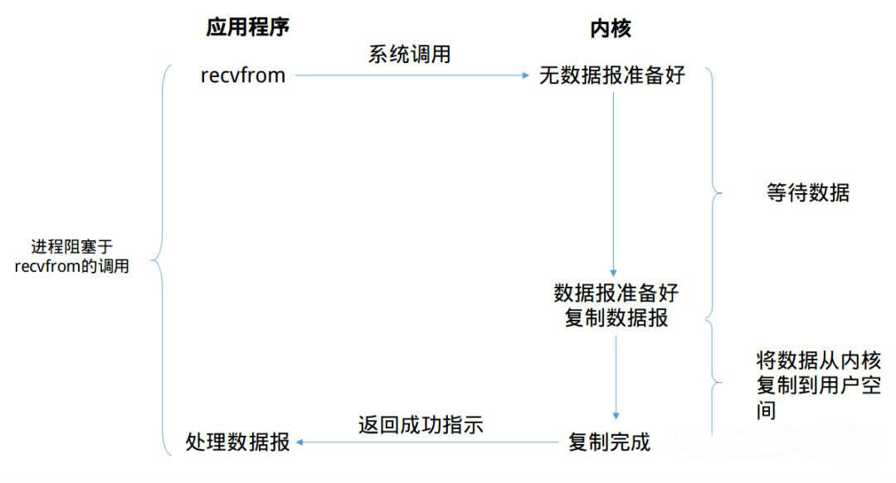
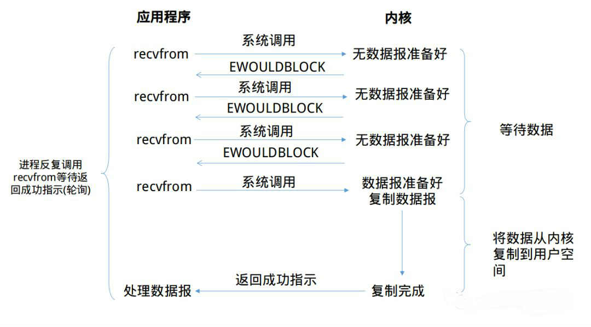
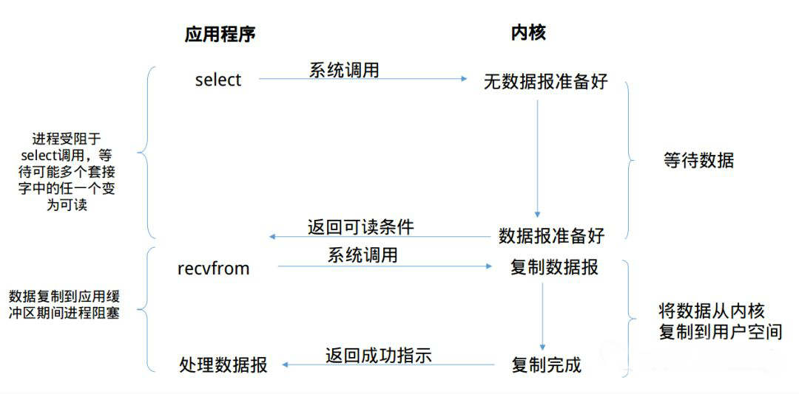
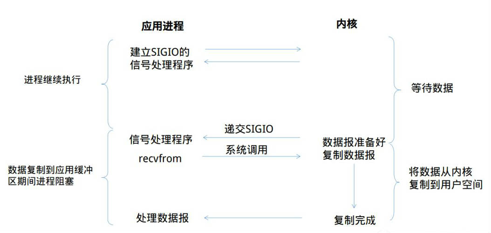
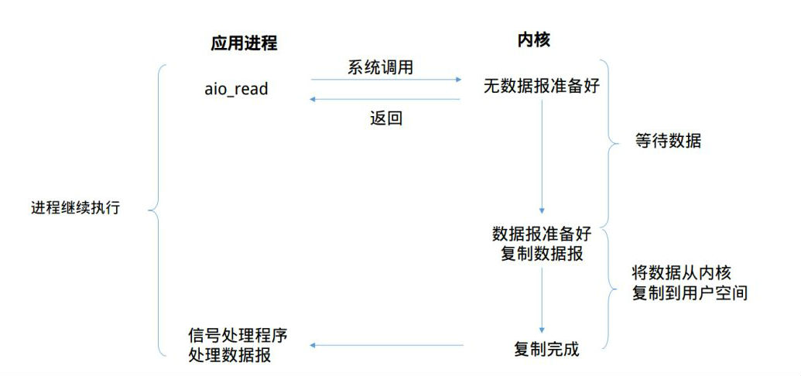

## Linux的5种I/O模型

讲到Linux，这种类unix操作系统的IO模型基本一致，一共5种IO模型：

1. 阻塞式I/O模型
1. 非阻塞式I/O模型
1. I/O复用型模型
1. 信号驱动I/O模型
1. 异步I/O模型

上面的5中I/O模型，应该所有的讲述Linux I/O模型的文章都会列举出来。在上述５种I/O模型中，前4种，其实都可以划分为同步I/O方式，**只有最有一种异步I/O模型才使用异步I/O方式。**

为什么这么划分呢，就得仔细看看这5种I/O模型到底是什么了。

### 1. 阻塞式I/O模型

通常我们使用的I/O都是阻塞式I/O，在编程时使用的大多数也是阻塞式I/O。在默认情况下，所有的套接字(socket)都是阻塞的。下图解释了阻塞式I/O模型的流程。

上图中，我们说从调用recvfrom开始到它返回的整段时间内是被阻塞的，recvfrom成功返回后，引用程序才开始处理数据报。

#### 阻塞式I/O的优缺点

* 优点：

阻塞式I/O很容易上手，一般程序按照read-process的顺序进行处理就好。通常来说我们编写的第一个TCP的C/S程序就是阻塞式I/O模型的。并且该模型定位错误，在阻塞时整个进程将被挂起，基本不会占用CPU资源。

* 缺点:
 
该模型的缺点也十分明显。作为服务器，需要处理同时多个的套接字，使用该模型对具有多个的客户端并发的场景时就显得力不从心。当然也有补救方法，我们使用多线程技术来弥补这个缺陷。但是多线程在具有大量连接时，多线程技术带来的资源消耗也不容小看。

### 2. 非阻塞式I/O
有阻塞I/O，那么也会有非阻塞I/O，在上文说过默认情况下，所有的套接字都是阻塞的，那么通过设置套接字的NONBLOCK(**一般在open(),socket()**等调用中设置)标志或者设置recv、send等输入输出函数的MSG_DONTWAIT标志就可以实现非阻塞操作。

那我们来看看非阻塞I/O模型的运行流程：

可以看到，前三次recvfrom时没有数据可以返回，此时内核不阻塞进程，转而立即返回一个EWOULDBLOCK错误。第四次调用recvfrom时已经有一个数据报准备好了，此时它将被复制到应用进程的缓冲区，于是recvfrom调用成功返回。

当一个应用进程像这样对一个非阻塞描述符循环调用recvfrom时，我们称之为轮询(polling)。

#### 非阻塞式I/O的优缺点

* 优点：

这种I/O方式也有明显的优势，即不会阻塞在内核的等待数据过程，每次发起的I/O请求可以立即返回，不用阻塞等待。在数据量收发不均，等待时间随机性极强的情况下比较常用。

* 缺点：

轮询这一个特征就已近暴露了这个I/O模型的缺点。轮询将会不断地询问内核，这将占用大量的CPU时间，系统资源利用率较低。同时，该模型也不便于使用，需要编写复杂的代码。

### 3. I/O复用模型
上文中说到，在出现大量的链接时，使用多线程+阻塞I/O的编程模型会占用大量的内存。那么I/O复用技术在内存占用方面，就有着很好的控制。

当前的高性能反向代理服务器Nginx使用的就是I/O复用模型(epoll),它以高性能和低资源消耗著称，在大规模并发上也有着很好的表现。,那么，我们就来看一看I/O复用模型的面目。

那到底什么是I/O复用(I/O multiplexing)。根据我的理解，复用指的是复用线程，从阻塞式I/O来看，基本一个套接字就霸占了整个线程。

例如当对一个套接字调用recvfrom调用时，整个线程将被阻塞挂起，直到数据报准备完毕。多路复用就是复用一个线程的I/O模型，Linux中拥有几个调用来实现I/O复用的系统调用——**select,poll,epoll（Linux 2.6+）**线程将阻塞在上面的三个系统调用中的某一个之上，而不是阻塞在真正的I/O系统调用上。I/O复用允许对多个套接字进行监听，当有某个套接字准备就绪(可读/可写/异常)时，系统调用将会返回。
然后我们可能将重新启用一个线程并调用recvfrom来将特定套接字中的数据报从内核缓冲区复制到进程缓冲区。

#### I/O复用模型的优缺点

* 优点：

I/O复用技术的优势在于，只需要使用一个线程就可以管理多个socket，系统不需要建立新的进程或者线程，也不必维护这些线程和进程，所以它也是很大程度上减少了资源占用。另外I/O复用技术还可以同时监听不同协议的套接字。

* 缺点

在只处理连接数较小的场合，使用select的服务器不一定比多线程+阻塞I/O模型效率高，可能延迟更大，因为单个连接处理需要2次系统调用，占用时间会有增加。

### 4. 信号驱动式I/O模型

当然你可能会想到使用信号这一机制来避免I/O时线程陷入阻塞状态。那么内核开发者怎么可能会想不到。那么我们来看看信号驱动I/O模型的具体流程：

从上图可以看到，我们首先开启套接字的信号驱动I/O功能，并通过sigaction系统调用来安装一个信号处理函数，我们进程不会被阻塞。
当数据报准备好读取时，内核就为该进程产生一个SIGIO信号，此时我们可以在信号处理函数中调用recvfrom读取数据报，并通知数据已经准备好，正在等待处理。

### 信号驱动I/O模型的优缺点

* 优点：

很明显，我们的线程并没有在等待数据时被阻塞，可以提高资源的利用率

* 缺点：

其实在Unix中，信号是一个被过度设计的机制(这句话来自知乎大神,有待考究)
信号I/O在大量IO操作时可能会因为信号队列溢出导致没法通知——这个是一个非常严重的问题。

### 5. 异步I/O模型

异步I/O，是由POSIX规范定义的。这个规范定义了一些函数，这些函数的工作机制是：告知内核启动某个操作，并让内核在整个操作完成后再通知我们。(包括将数据从内核复制到我们进程的缓冲区)，照样，先看模型的流程：

全程没有阻塞，真正做到了异步，异步的优点还用说明吗？

### 6，总结
关于对Linux 的I/O模型的学习就写到这里，每个模型都有自己使用的范围
Talk is cheap, show me the code
实践出真知。

